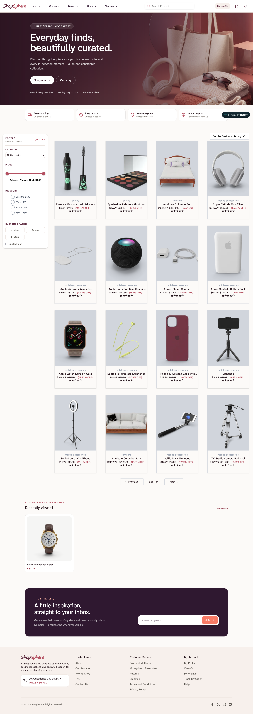

# ecommerce_app

A full-stack e-commerce application with a responsive React storefront and a Node.js API. Customers can browse a product catalogue, refine results, view product details, save favourites, manage their cart, and sign in to an account.

## Features

- Browse a responsive, paginated product catalogue
- Filter by category, price, discount, rating, and availability
- Sort products by rating or price
- View product images, prices, discounts, ratings, and details
- Add products to a cart or wishlist
- Sign up, sign in, and manage an account session
- Explore supporting pages for shipping, returns, payments, FAQs, and contact details
- Access API documentation at `/api-docs`

## Built with

- React, Vite, Redux, and Tailwind CSS
- Node.js and Express
- MongoDB and Mongoose

## Frontend snapshot



## Run locally

```bash
git clone https://github.com/miral-harsora/ecommerce_app.git
cd ecommerce_app
npm install
npm --prefix client install
```

Create a `.env` file based on `.env.example`, add your MongoDB connection string and `JWT_SECRET`, then run:

```bash
npm run dev
```

In a second terminal, start the frontend:

```bash
npm run client:dev
```

The API runs on `http://localhost:3001` and the frontend on `http://localhost:5173`.

## Project structure

- `client/` — React storefront
- `controllers/`, `models/`, and `routes/` — Express API implementation
- `middleware/` — authentication middleware
- `scripts/seedProducts.js` — product catalogue seeding script
